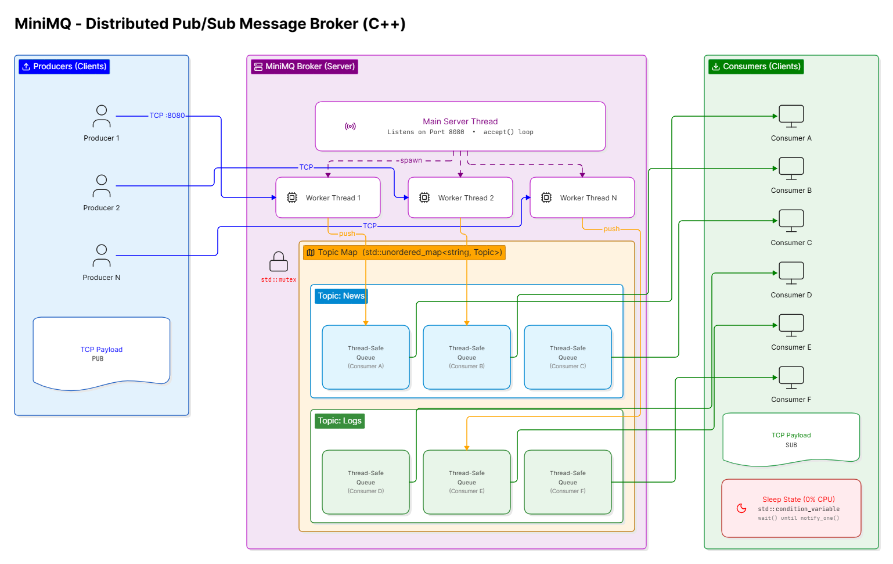

# 🚀 MiniMQ – Real-Time Distributed Message Broker


A lightweight, high-performance **Publish/Subscribe Message Broker** built completely from scratch using **Modern C++17**.

MiniMQ demonstrates the fundamentals of distributed systems by implementing a real-time messaging platform over raw TCP sockets without relying on external messaging frameworks. The project showcases **multithreading, synchronization, socket programming, concurrent data structures, and event-driven architecture**.

Inspired by systems like **Kafka**, **RabbitMQ**, and **Redis Pub/Sub**, MiniMQ focuses on understanding how message brokers work internally rather than replicating their full feature set.

---

# ✨ Features

* 🚀 Real-time Publish/Subscribe messaging
* 🔥 Multi-threaded TCP server
* 📡 Topic-based message routing
* 🧵 Dedicated worker thread for every client
* 🔒 Thread-safe shared data structures
* ⚡ Event-driven communication
* 💤 Zero busy waiting using Condition Variables
* 📥 Multiple producers and consumers
* 📊 Low idle CPU utilization
* 🏗 Clean modular architecture
* 💻 Built entirely using Modern C++17

---

# 🎥 Project Demonstration

> **Demo Video**

[▶ Click here to watch the high-resolution demo video on Google Drive](https://drive.google.com/file/d/10Ns-CAmjnWj6PBIcOWSPgCvxvXim34TT/view?usp=drive_link)

---

# 🏛️ System Architecture

The following diagram illustrates the overall Publish/Subscribe architecture of MiniMQ.

<p align="center">
  
</p>

---

# 📌 System Workflow

```text
             +----------------+
             |   Producer(s)  |
             +--------+-------+
                      |
                      |
                TCP Socket
                      |
                      ▼
          +----------------------+
          |      MiniMQ Broker   |
          +----------------------+
          | Topic Manager        |
          | Message Queues       |
          | Thread Management    |
          +----------+-----------+
                     |
      +--------------+--------------+
      |                             |
      ▼                             ▼
Consumer A                    Consumer B
```

---

# 🛠 Technology Stack

| Category            | Technology                   |
| ------------------- | ---------------------------- |
| Language            | C++17                        |
| Networking          | Winsock2                     |
| Concurrency         | std::thread                  |
| Synchronization     | std::mutex                   |
| Thread Coordination | std::condition_variable      |
| Containers          | unordered_map, vector, queue |
| Build Tool          | g++                          |
| Platform            | Windows                      |

---

# 🧠 Core Concepts Demonstrated

This project demonstrates several important Computer Science concepts:

* TCP Socket Programming
* Concurrent Programming
* Producer-Consumer Pattern
* Publish/Subscribe Architecture
* Thread Synchronization
* Mutex Locking
* Condition Variables
* Shared Memory Management
* Event-Driven Systems
* Distributed Messaging

---

# ⚙️ Architecture Overview

MiniMQ consists of three independent components.

## 🖥 Broker

The broker acts as the central messaging server.

Responsibilities:

* Accept incoming TCP connections
* Maintain topics
* Manage subscribers
* Route messages
* Synchronize shared resources
* Notify waiting consumers

---

## 📤 Producer

The producer publishes messages to a topic.

Example:

```
publish sports India won the match!
```

The producer never communicates directly with consumers.

---

## 📥 Consumer

Consumers subscribe to one or more topics.

Example:

```
subscribe sports
```

Whenever a new message arrives, the consumer immediately receives it in real time.

---

# 🔄 Concurrency Model

MiniMQ eliminates the traditional **busy-wait polling** approach by using **Condition Variables**.

## Step 1

A consumer subscribes to a topic.

The worker thread enters a sleeping state.

```cpp
condition_variable.wait(lock);
```

The operating system suspends the thread, resulting in almost **0% CPU usage** while waiting.

---

## Step 2

A producer publishes a message.

The broker:

* locks shared resources
* stores the message
* pushes it into subscriber queues

```cpp
std::lock_guard<std::mutex>
```

ensures thread-safe access.

---

## Step 3

The broker wakes the sleeping consumer thread.

```cpp
condition.notify_one();
```

Only the required thread resumes execution and immediately sends the message over the TCP socket.

---

# ⚡ Why Condition Variables?

Without condition variables:

```
while(true)
{
    checkQueue();
}
```

The CPU continuously checks for new messages even when nothing happens.

This wastes CPU cycles.

MiniMQ avoids this problem by allowing threads to sleep until new work becomes available.

Benefits:

* Lower CPU utilization
* Faster response time
* Efficient scheduling
* Better scalability

---

# 📂 Project Structure

```
MiniMQ/
│
├── broker.cpp
├── producer.cpp
├── consumer.cpp
├── ThreadSafeQueue.h
├── README.md
├── architecture.png
└── demo.mp4
```

---

# 🚀 Getting Started

## Prerequisites

* Windows
* GCC / MinGW (MSYS2)
* C++17 Compiler

---

## Compile

Open a terminal inside the project directory.

Compile the broker:

```bash
g++ -std=c++17 -pthread broker.cpp -o broker.exe -lws2_32
```

Compile the producer:

```bash
g++ -std=c++17 -pthread producer.cpp -o producer.exe -lws2_32
```

Compile the consumer:

```bash
g++ -std=c++17 -pthread consumer.cpp -o consumer.exe -lws2_32
```

---

# ▶ Running the Project

## Step 1

Start the broker.

```bash
broker.exe
```

---

## Step 2

Open another terminal.

Run a consumer.

```bash
consumer.exe
```

Subscribe to a topic.

```
subscribe sports
```

---

## Step 3

Open another terminal.

Run the producer.

```bash
producer.exe
```

Publish a message.

```
publish sports India won the match!
```

---

# 📸 Example Output

### Producer

```
Connected to broker...

publish sports India won the match!

Message sent successfully.
```

---

### Consumer

```
Connected to broker...

Subscribed to sports

Received:

India won the match!
```

---

# 🔒 Thread Safety

MiniMQ protects all shared resources using mutexes.

Critical sections include:

* Topic map
* Subscriber list
* Message queues

Synchronization primitives used:

* std::mutex
* std::lock_guard
* std::unique_lock
* std::condition_variable

This prevents:

* Race Conditions
* Deadlocks
* Data Corruption
* Concurrent Modification Errors

---

# 📈 Performance Characteristics

| Feature          | Implementation             |
| ---------------- | -------------------------- |
| Network Protocol | TCP                        |
| Client Handling  | One Thread per Client      |
| Communication    | Publish / Subscribe        |
| Synchronization  | Mutex + Condition Variable |
| Busy Waiting     | ❌ Eliminated               |
| Idle CPU Usage   | Near Zero                  |
| Message Delivery | Event Driven               |

---

# 🚀 Future Improvements

* Persistent Message Storage
* Message Acknowledgements
* Broker Clustering
* Load Balancing
* Authentication
* TLS Encryption
* Docker Support
* Linux Compatibility
* Configuration Files
* Web Monitoring Dashboard
* REST Management API
* Message Priorities

---

# 📚 Learning Outcomes

Building MiniMQ provided hands-on experience with:

* Modern C++17
* Socket Programming
* Concurrent Programming
* Thread Synchronization
* Publish/Subscribe Systems
* Distributed System Fundamentals
* Network Communication
* Operating System Concepts
* Event-Driven Design
* Multi-threaded Server Development

---

# 🤝 Contributing

Contributions, feature requests, and suggestions are welcome.

Feel free to fork the repository, open an issue, or submit a pull request.

---

# 📄 License

This project is licensed under the **MIT License**.

Feel free to use, modify, and distribute it for educational and personal purposes.

---

# ⭐ If you found this project useful...

Please consider giving it a ⭐ on GitHub.

It motivates me to build more open-source systems projects!
